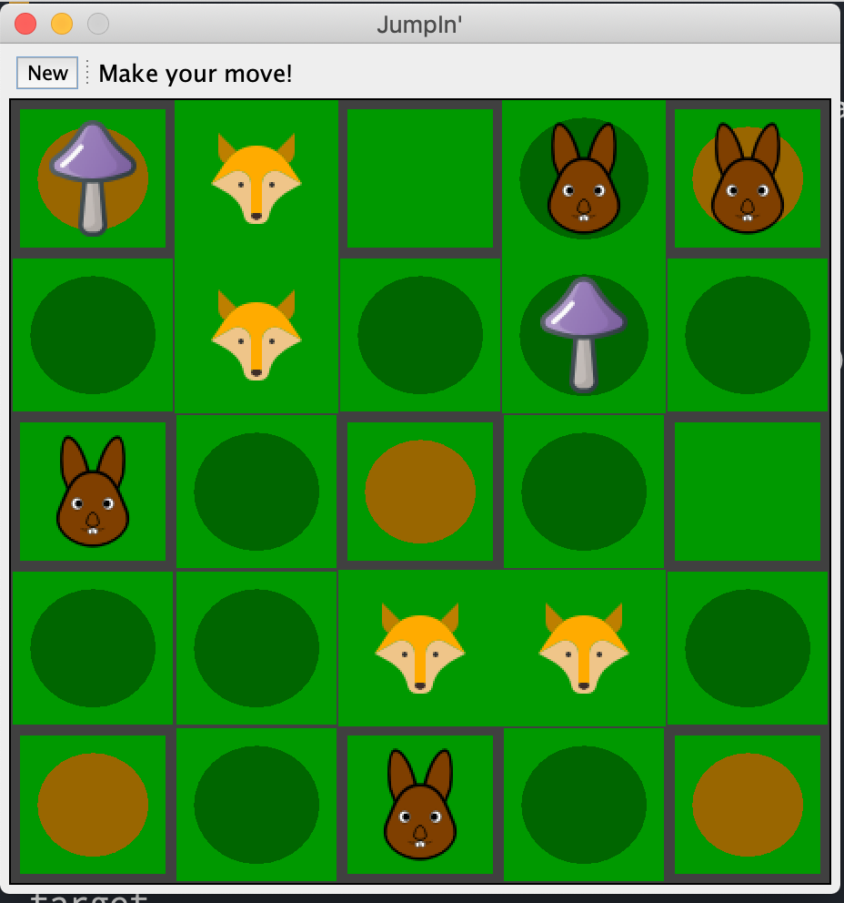

# SYSC3110 Group project

Third year Software Engineering project at Carleton University. The task was to replicate the childrens board game JumpIN. 

More information on rules and gameplay can be found at JumpIN's official website: 
https://www.smartgames.eu/uk/one-player-games/jumpin

## Contributors
- John Grabkowski: johngrabkowski@cmail.carleton.ca
- Rafi Khan: rafikhan3@cmail.carleton.ca
- Kamran Sagheir: kamransagheir@cmail.carleton.ca
- Anton Aroche: antonaroche@cmail.carleton.ca
- Christopher D'silva: chrisdsilva@cmail.carleton.ca

## Resources
- PMD Ruleset: Using bestpractices from [PMD](https://github.com/pmd/pmd/blob/master/pmd-java/src/main/resources/category/java/bestpractices.xml)
